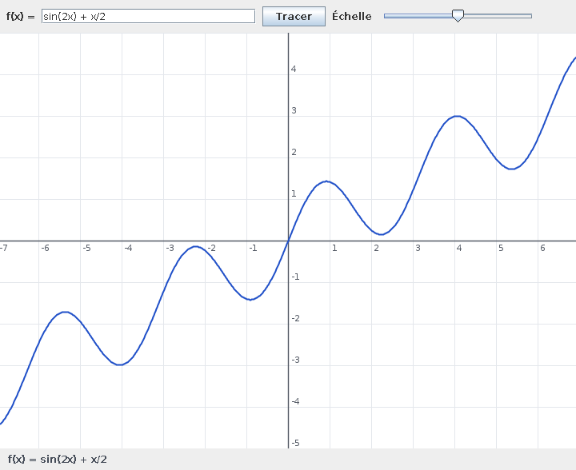

# Traceur de fonctions — interpréteur d'expressions en Java

Application Java (Swing) qui trace le graphe d'une fonction saisie en texte, par exemple `sin(2x) + x/2` ou `x^3 - 3x`. Projet réalisé dans le cadre du cours de Théorie des Langages et Automates (TLA), sans aucune bibliothèque externe.



## Principe

L'intérêt du projet n'est pas l'interface, mais ce qui se passe derrière : transformer une chaîne de caractères en une structure qu'on peut évaluer, comme le fait un interpréteur.

1. **Analyse lexicale** (`Lexer.java`) : découpe l'expression en lexèmes (nombres, `x`, constantes, fonctions, opérateurs, parenthèses) et ajoute les multiplications implicites (`2x` → `2 * x`, `(x+1)(x-1)`).
2. **Analyse syntaxique** (`Parser.java`) : parseur récursif descendant qui construit un arbre de syntaxe abstraite selon la grammaire ci-dessous.
3. **Arbre de syntaxe** (`ASTNode.java`) : chaque nœud sait s'évaluer pour une valeur de `x`.
4. **Tracé** (`Plot.java`, `PlotPanel.java`) : un point par pixel de largeur, reliés en courbe continue. Le tracé s'interrompt aux valeurs non définies (`ln(x)` pour `x ≤ 0`) et aux asymptotes (`1/x`, `tan(x)`) au lieu de tracer des traits verticaux parasites.
5. **Interface** (`Main.java`) : saisie de la fonction, bouton *Tracer* ou touche Entrée, curseur d'échelle, message d'erreur explicite.

## Grammaire

Des règles de plus faible à plus forte priorité :

```
expr    := term   (('+' | '-') term)*
term    := unary  (('*' | '/') unary)*
unary   := ('-' | '+') unary | power
power   := primary ('^' unary)?
primary := NOMBRE | 'x' | 'pi' | 'e'
         | FONCTION '(' expr ')'
         | '(' expr ')'
```

Ce que cette grammaire garantit :

| Expression | Lecture | Pourquoi |
|---|---|---|
| `1 + 2 * 3` | `1 + (2 * 3)` | `*` est prioritaire sur `+` |
| `10 - 4 - 3` | `(10 - 4) - 3` = 3 | `-` et `/` s'enchaînent de gauche à droite |
| `2^3^2` | `2^(3^2)` = 512 | `^` est associatif à droite, comme en mathématiques |
| `-x^2` | `-(x^2)` | la puissance passe avant le moins unaire |
| `2^-1` | 0,5 | l'exposant peut être négatif |

Fonctions disponibles : `sin`, `cos`, `tan`, `sqrt`, `exp`, `ln`, `abs`. Constantes : `pi`, `e`.

Une expression invalide n'est jamais tracée à moitié : l'erreur est signalée avec sa position, par exemple « Parenthèse ouverte non fermée (position 1) » ou « Nom inconnu « y » ».

## Lancer le projet

Java 17 ou plus récent.

```bash
javac -encoding UTF-8 -d out src/tlaprojet/*.java
java -cp out tlaprojet.Main
```

On peut passer la fonction de départ en argument : `java -cp out tlaprojet.Main "x^3 - 3x"`.

## Tests

32 tests sans dépendance : priorité et associativité des opérateurs, moins unaire, multiplication implicite, fonctions, et messages d'erreur.

```bash
javac -encoding UTF-8 -d out src/tlaprojet/*.java test/tlaprojet/*.java
java -cp out tlaprojet.ParserTest
```

## Structure

```
src/tlaprojet/
├── Token.java        # lexème (type, valeur, position)
├── SyntaxError.java  # erreur avec position
├── Lexer.java        # analyse lexicale + multiplication implicite
├── Parser.java       # parseur récursif descendant
├── ASTNode.java      # arbre de syntaxe et évaluation
├── Plot.java         # axes, graduations, courbe
├── PlotPanel.java    # composant Swing
└── Main.java         # fenêtre et interactions
test/tlaprojet/
└── ParserTest.java
```

## Limites

- Une seule variable (`x`) et des fonctions à un seul argument.
- Pas de dérivée ni de calcul symbolique : l'arbre sert uniquement à évaluer.

## Stack technique

Java · Swing · analyse lexicale et syntaxique écrites à la main
